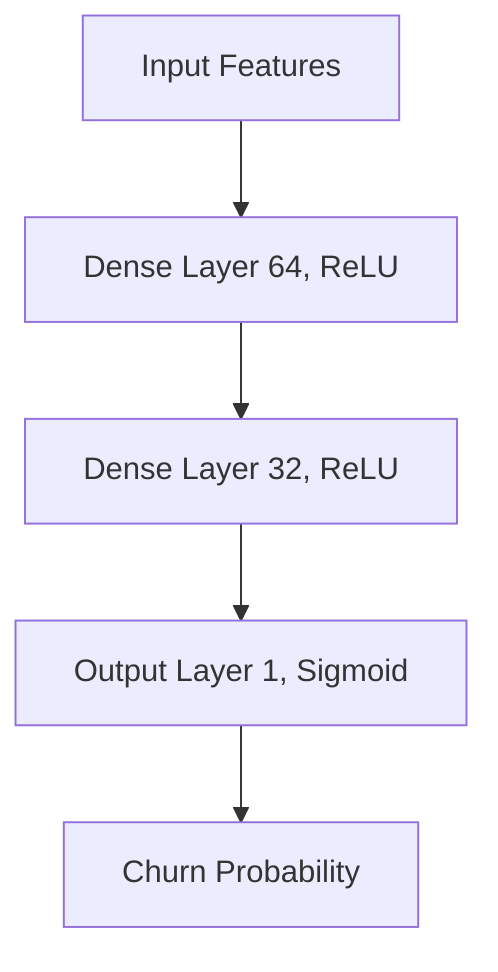

# 📊 Customer Churn Prediction using Artificial Neural Networks (ANN)


## 📌 Project Overview
Understand and predict customer attrition (churn) is critical for businesses to maintain growth and profitability. This project implements a comprehensive machine learning pipeline using **Artificial Neural Networks (ANN)** to predict whether a bank customer is likely to leave based on various demographic and financial factors.

The solution includes data preprocessing, model training with early stopping, hyperparameter tuning, and a user-friendly **Streamlit web application** for real-time predictions.

## 🚀 Key Features
- **Deep Learning Model**: Built with TensorFlow/Keras, featuring multiple hidden layers and dropout for regularization.
- **Robust Preprocessing**: Automated handling of categorical data (Label Encoding, One-Hot Encoding) and feature scaling.
- **Hyperparameter Tuning**: Performance optimization through systematic tuning.
- **Real-time Prediction**: A streamlined web interface built with Streamlit for business users.
- **Training Insights**: Integrated with TensorBoard for tracking training curves and loss metrics.
- **Early Stopping**: Prevents overfitting by monitoring validation loss.

## 🛠️ Tech Stack
- **Languages**: Python
- **DL Framework**: TensorFlow, Keras
- **ML Utilities**: Scikit-Learn (StandardScaler, LabelEncoder, OneHotEncoder)
- **Data Handling**: Pandas, NumPy
- **Deployment**: Streamlit
- **Visualization**: Matplotlib, TensorBoard

## 📁 Project Structure
```text
├── Churn_Modelling.csv         # Dataset
├── app.py                      # Streamlit application source code
├── experiment.ipynb            # Model development & training notebook
├── hyperparameter.ipynb        # Hyperparameter tuning experiments
├── prediction.ipynb            # Inference and testing notebook
├── model.h5                    # Trained ANN model
├── Scaler.pkl                  # Saved StandardScaler object
├── Label_encoder_gender.pkl    # Gender encoder
├── geo_encoded_value.pkl       # Geography One-Hot encoder
├── requirements.txt            # Project dependencies
└── logs/                       # TensorBoard training logs
```

## ⚙️ Installation & Setup

1. **Clone the repository**:
   ```bash
   git clone https://github.com/your-username/churn-prediction-ann.git
   cd churn-prediction-ann
   ```

2. **Create a virtual environment**:
   ```bash
   python -m venv venv
   source venv/bin/activate  # On Windows: venv\Scripts\activate
   ```

3. **Install dependencies**:
   ```bash
   pip install -r requirements.txt
   ```

## 🖥️ Usage

### Running the Web App
Execute the following command to launch the interactive Streamlit dashboard:
```bash
streamlit run app.py
```

### Exploring Notebooks
- `experiment.ipynb`: Dive into the EDA and core model architecture.
- `hyperparameter.ipynb`: See how the model was optimized.

## 🧠 Model Architecture
The ANN is composed of:
1. **Input Layer**: 12 feature inputs (after encoding).
2. **Hidden Layer 1**: 64 neurons, ReLU activation.
3. **Hidden Layer 2**: 32 neurons, ReLU activation.
4. **Output Layer**: 1 neuron, Sigmoid activation (for binary classification).



## 📈 Performance
- **Validation Accuracy**: ~86%
- **Loss Function**: Binary Crossentropy
- **Optimizer**: Adam

## 🔮 Future Improvements
- [ ] Implement SMOTE for handling class imbalance in the dataset.
- [ ] Integrate more advanced architectures like XGBoost for comparison.
- [ ] Deploy the app using Docker and AWS/Heroku.

## 🤝 Contributing
Contributions are welcome! Please feel free to submit a Pull Request.

---
*Created with ❤️ by Sourav Sinha*
